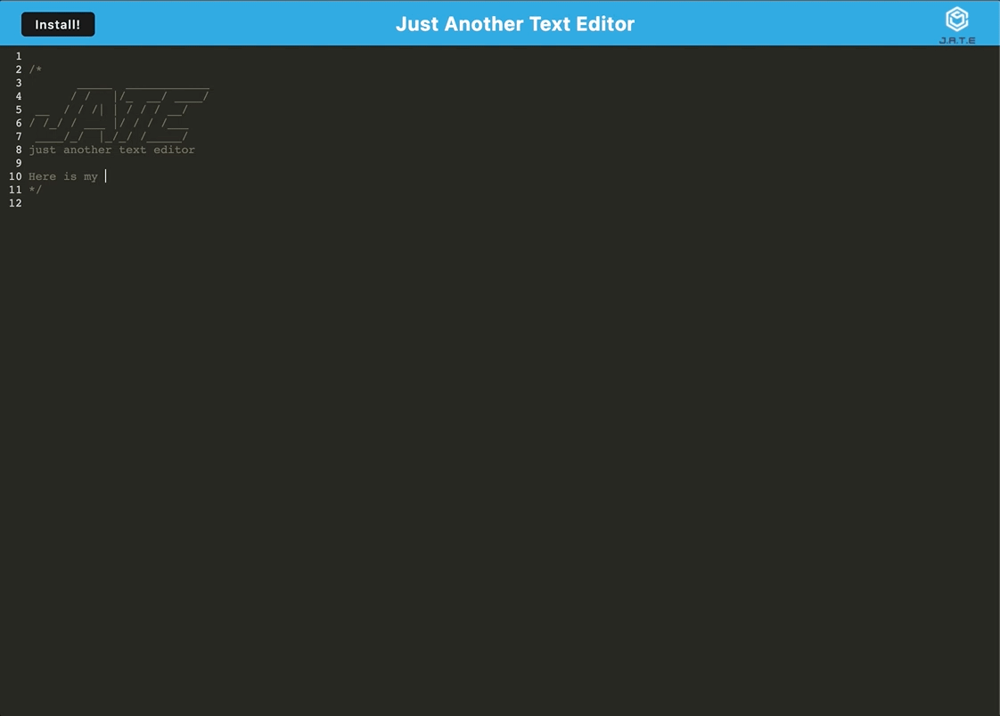

<div id="top"></div>
<div align="center">

[![Issues][issues-shield]][issues-url]
[![MIT License][license-shield]][license-url]
[![linkedin][linkedin-shield]][linkedin-url]

</div>
 <br />
 <br />

<div align="center">

</div>

<h1 align="center">Just Another Text Editor</h1>

  <p align="center">
    JATE or Just Another Text Editor is a text editor application that persists online after a page refresh and complies to an installable application. JATE persists in IndexDB and as a service worker so that when a user refreshes their page their previously entered text still persists. The application is hosted and complied within Heroku giving the site a dynamic feel. The application is also downloadable which allows a user to use the text-editor offline! 
    <br />
    <a href="https://github.com/TomSouthwick/Text-Editor"><strong>Explore the docs »</strong></a>
    <br />
    <br />
    ·
    <a href="https://youtu.be/TU0WPS97mts">View Demo</a>
    ·
    <a href="https://spiceyfriedrice.herokuapp.com/"><strong>View App</strong></a>
    ·
    <a href="https://github.com/TomSouthwick/Text-Editor">Report Bug</a>
    ·
    <a href="https://github.com/TomSouthwick/Text-Editor">Request Feature</a>
  </p>
</div>
<div align="center">

</div>
 <br />
 <br />
<!-- TABLE OF CONTENTS -->
<h3/>
<b/>
<details>
  <summary>Table of Contents</summary>
  <ol>
    <li>
      <a href="#about-the-project">About The Project</a>
      <ul>
        <li><a href="#built-with">Built With</a></li>
      </ul>
    </li>
    <li>
      <a href="#getting-started">Getting Started</a>
      <ul>
        <li><a href="#prerequisites">Prerequisites</a></li>
        <li><a href="#installation">Installation</a></li>
      </ul>
    </li>
    <li><a href="#usage">Usage</a></li>
    <li><a href="#roadmap">Roadmap</a></li>
    <li><a href="#license">License</a></li>
    <li><a href="#contact">Contact</a></li>
    <li><a href="#acknowledgments">Acknowledgments</a></li>
  </ol>
</details>
</h3>
</b>
 <br />
 <br />

<!-- ABOUT THE PROJECT -->

## About The Project

 <br />

 <br />

This project was designed to allow a user to write anything of their choosing within a persistent document. The application had to be downloadable and utilise webpack configurations that allow for the app to be complied using progressive web applications. The app is easy to install and use and if necessary can be downloaded and used offline without WIFI.

<p align="right">(<a href="#top">back to top</a>)</p>

### Built With

- [Webpack Plugins](https://webpack.js.org/plugins/)
- [Webpack Dev Server](https://webpack.js.org/configuration/dev-server/)
- [openDB](https://docs.blackboard.com/archive/b2/opendb/intro-to-opendb)
- [Babel](https://babeljs.io/)

<p align="right">(<a href="#top">back to top</a>)</p>

<!-- GETTING STARTED -->

## Getting Started

Clone the repo into a local folder. Open that folder in VS Code.

### Prerequisites

Ensure that VS Code has the required languages inc. JS, Express, and React with the respective functionalities built in.

### Installation

1. Clone the repo
   ```sh
   git clone https://github.com/TomSouthwick/Text-Editor.git
   ```
2. Install NPM packages
   ```sh
   npm install
   ```
3. Run develop
   ```sh
   npm run start:dev
   ```

<p align="right">(<a href="#top">back to top</a>)</p>

<!-- USAGE EXAMPLES -->

## Usage

Once you have the application running on either local host or Heroku --> use the text editor as you would any text editor, you can further download the app and use it offline

_For more examples, please refer to the [Documentation](https://github.com/TomSouthwick/Text-Editor)_

<p align="right">(<a href="#top">back to top</a>)</p>

<!-- ROADMAP -->

## Roadmap

- ✅ Learnt about PWA's
- ✅ Created openDB schema
- ✅ Designing database structure PWA applications
- ✅ Implemented authentication
- ✅ Implemented caching and change of focus saving
- ✅ Created a downloadable application with "addEventListener"
- ✅ Integrated into Heroku

See the [open issues](https://github.com/TomSouthwick/Text-Editor/issues) for a full list of proposed features (and known issues).

<p align="right">(<a href="#top">back to top</a>)</p>

<!-- CONTRIBUTING -->

<!-- LICENSE -->

## License

Distributed under the MIT License. See `LICENSE.txt` for more information.

<p align="right">(<a href="#top">back to top</a>)</p>

<!-- CONTACT -->

## Contact

Tom Southwick - [Linkedin](https://linkedin.com/in/tomsouthwick)

Project Link: [https://github.com/TomSouthwick/Text-Editor](https://github.com/TomSouthwick/Text-Editor)

<p align="right">(<a href="#top">back to top</a>)</p>

<!-- ACKNOWLEDGMENTS -->

## Acknowledgments

- [ReadMe](https://github.com/othneildrew/Best-README-Template.git)

<p align="right">(<a href="#top">back to top</a>)</p>

<!-- MARKDOWN LINKS & IMAGES -->
<!-- https://www.markdownguide.org/basic-syntax/#reference-style-links -->

[issues-shield]: https://img.shields.io/github/issues/TomSouthwick/Text-Editor.svg?style=for-the-badge
[issues-url]: https://github.com/TomSouthwick/Text-Editor/issues
[license-shield]: https://img.shields.io/github/license/TomSouthwick/Team-Profile-Generator.svg?style=for-the-badge
[license-url]: https://github.com/TomSouthwick/Text-Editor/blob/master/LICENSE.txt
[linkedin-shield]: https://img.shields.io/badge/-LinkedIn-black.svg?style=for-the-badge&logo=linkedin&colorB=555
[linkedin-url]: https://linkedin.com/in/tomsouthwick
[product-screenshot]: ./assets/screenshot123.png
